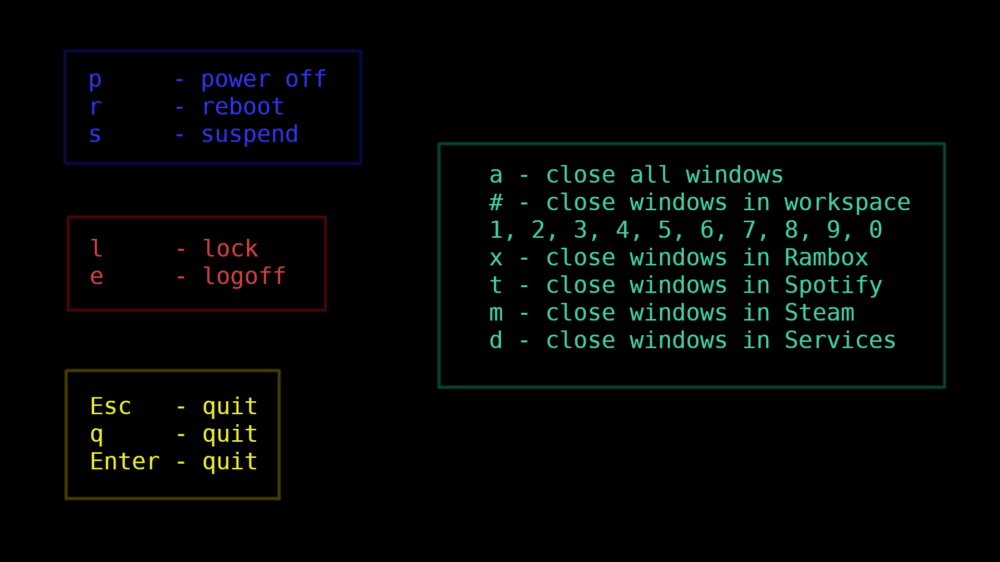
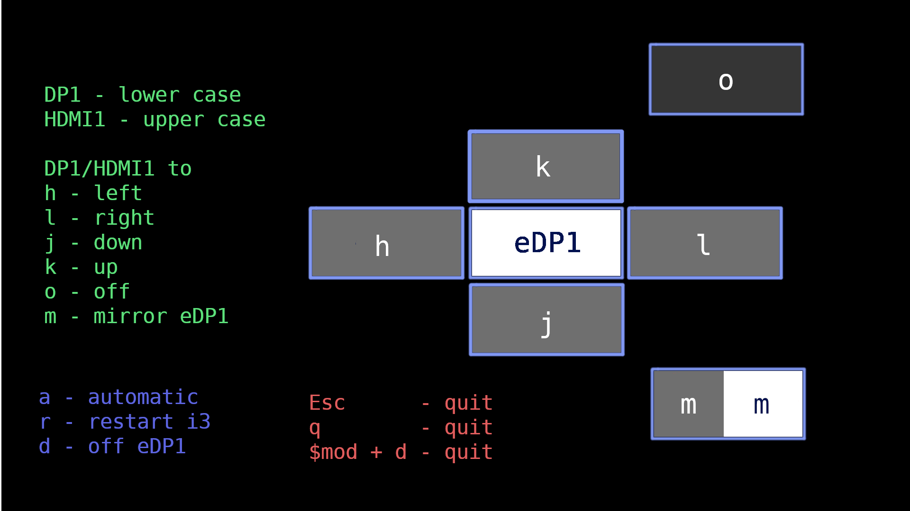

# [i3 wm](https://i3wm.org/)

I3 wm is a simple and lightweight window manager


Image from site i3wm

# Init i3wm

To execute i3wm, use the follow code in .xinitrc.

```
numlockx &

xautolock -time 15 -nowlocker "$HOME/.config/i3/i3exit.sh lock" -locker "$HOME/.config/i3/i3exit.sh suspend" -notify 30 -notifier "i3-nagbar -m 'Computer was suspended'" &

$HOME/.config/i3/i3exit.sh lock

$HOME/.config/i3/wallpaper.sh 600 &

exec i3
```

# Power buttons

To allow or disable the poweroff and sleep buttons, check if system has a
`/etc/systemd/logind.conf`. Or check for manual `man logind.conf`. It's possible to configure the IdleAction to system. Like poweroff or suspend after IdleActionSec.

```
HandlePowerKey=ignore
HandleSuspendKey=ignore
```

## Power management

After disabling the buttons of power off and suspend, use the follow key bind in
[i3 configuration](config).

Use your custom keys and configs to power management, remember to generate a image with this comands. Press `$mod + Shift + e` to access this mode.

When you set a background using feh, you don't use the flag `--no-fehbg`, it generates a file in `$HOME/.fehbg` to recover the
last background using the script of `$HOME/.fehbg`, generated by feh.



This configuration above can be customized. Add your commands in mode **Power Management** on [config](config).

```
# Set poweroff workspace
set $options "Options"
# The bind allows you to back in Options workspace.
bindsym $mod+0 workspace $options

bindsym $mod+Shift+e mode "Power Management"; workspace $options; exec feh --no-startup-id --no-fehbg --bg-fill $HOME/.config/i3/power_management.png

mode "Power Management" {
  # Here goes your custom keys to manage the power. As example, p to power off.
  bindsym p exec "$HOME/.config/i3/i3exit.sh poweroff"

  # If you don't randomize your background image, just use $HOME/.fehbg to 
  # use your last wallpaper image. Exit the mode pressing Esc key
  bindsym Escape mode "default"; workspace back_and_forth; exec --no-startup-id feh --bg-fill --randomize $HOME/.wallpapers/*
}
```


# Polybar

Polybar is an highly customizable status bar. It used with i3wm to provide few
informations about the system, windows and useful menus.

The bar is defined as bar/status. To lauch polybar in i3, add the script
[launch](launch_polybar.sh) in configuration file of i3. Use the flag -c to
indicate where is the [polybar configuration](polybar). Using this configuration
file, will generate the following bar.

**Polybar used modules**

* module/xwindow: native module
* module/i3: native module
* module/xbacklight: native module
* module/cpu: native module
* module/memory: native module
* module/swap: native module
* module/wlan: native module
* module/eth: native module
* module/date: native module
* module/pulseaudio: native module
* module/battery: native module
* module/cpu-temp: native module
* module/powermenu: custom menu script using [i3exit](i3exit.sh)
* module/mplayer: custom player control using [playerctl](player.sh)
* module/gpu: custom system [NVIDIA GPU](gpu.sh) status


# Wallpaper

To set a specific image to background, use [feh](https://feh.finalrewind.org/).

```
feh --bg-fill --randomize ~/.wallpapers/*
```


To change the background every X times, use the [wallpaper](wallpaper.sh) script.

```
~/.config/i3/wallpaper.sh X &
```

To execute it every time the i3wm starts, add it in .xinitrc

# Autolock

[Xautolock](https://linux.die.net/man/1/xautolock) is a program that fire others programs after X times. Use it to lock
your screen or suspend the notebook. Use i3-nagbar to notify the action. Use the
[i3exit](i3exit.sh) to manager the actions.

```
xautolock -time 15 \
  -nowlocker "$HOME/.config/i3/i3exit.sh lock" \
  -locker "$HOME/.config/i3/i3exit.sh suspend" \
  -notify 30 -notifier "i3-nagbar -m 'Computer was suspended'"
```

To disable the current xautolock ```xautolock -disable``` and ```xautolock
-enable``` to enable it. It's useful when whatching movies, animes, series.

# Display management

This config, has a specific window mode that manage the DP1 and HDMI1 displays using the `xrandr` program.
To access this mode, press `$mod + d`. This will change your actual workspace to Options and will show you the options.

When you set a background using feh, you don't use the flag `--no-fehbg`, it generates a file in `$HOME/.fehbg` to recover the
last background using the script of `$HOME/.fehbg`, generated by feh. 



You can customize the commands in image above, add your commands inside the mode **Display Management** on [config](config).

```
# Set poweroff workspace
set $options "Options"
# The bind allows you to back in Options workspace.
bindsym $mod+0 workspace $options

bindsym $mod+d mode "Display Management"; workspace $options; exec --no-startup-id feh --no-fehbg --bg-fill "$HOME/.config/i3/window_management.png"

mode "Display Management" {
  # Automatic adjust
  bindsym a exec "xrandr --auto"
  
  # Reset i3 manager, go to previous workspace setting a random background.
  bindsym r workspace back_and_forth; mode "default"; exec feh --bg-fill --randomize $HOME/.wallpapers/*; restart
  
  # Exit this mode, go to previous workspace setting a random background 
  bindsym Escape mode "default"; workspace back_and_forth; exec --no-startup-id feh --bg-fill --randomize $HOME/.wallpapers/*
}

```
